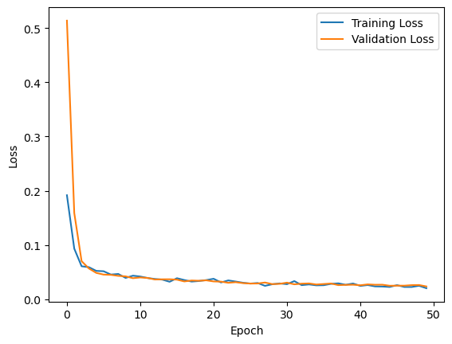
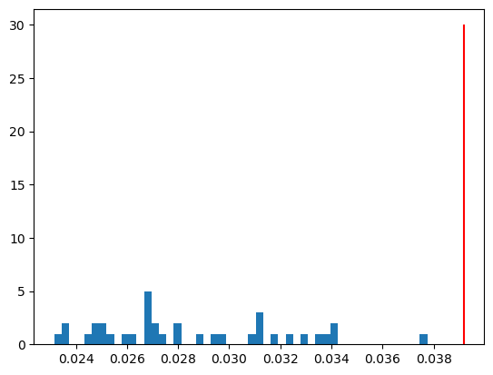
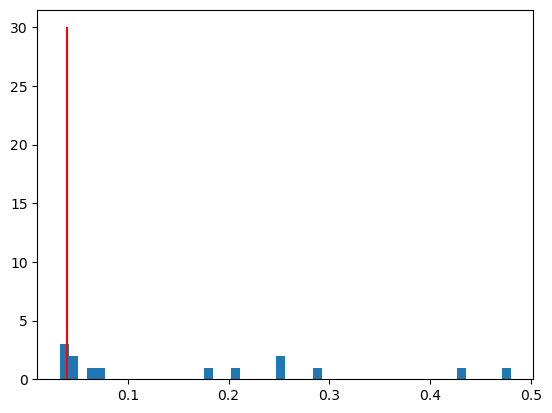
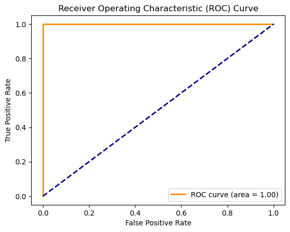
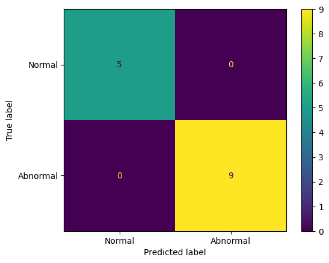
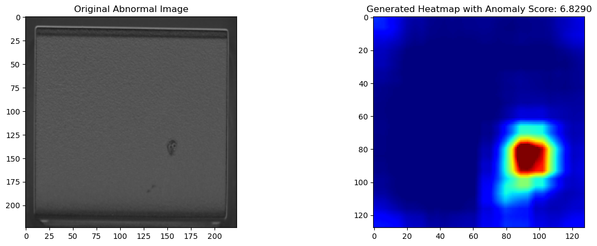
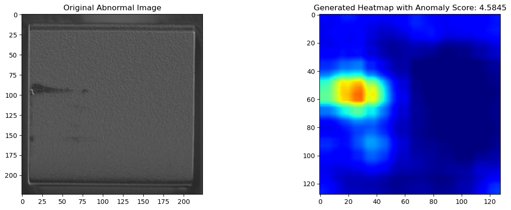
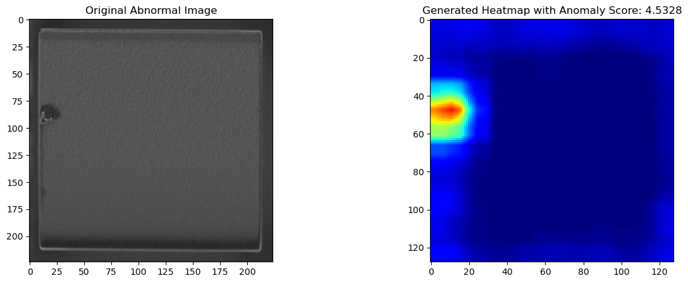

# AI-based Anomaly Detection

Anomaly detection using a pretrained ResNet50 feature extractor combined with a 1×1 convolutional AutoEncoder. Intermediate feature maps from `layer2` and `layer3` of ResNet50 are reconstructed by the AutoEncoder; the pixel-wise reconstruction error is used as an anomaly score.

## Project Structure

```
.
├── config.py       # Paths, device, and hyperparameters
├── dataset.py      # Transforms and train/val dataloaders
├── models.py       # ResnetFeatures + AutoEncoder
├── train.py        # Training loop, early stopping, checkpoint save/load
├── evaluate.py     # Decision function, thresholding, metrics, visualizations
└── main.py         # Full pipeline entry point
```

## Dataset

Expected directory layout:

```
dataset/
├── train/
│   └── good/           # Normal training images
└── test/
    ├── good/           # Normal test images
    └── bad/            # Abnormal test images
```

## Installation

```bash
pip install torch torchvision numpy pillow matplotlib seaborn scikit-learn opencv-python tqdm
```

## Usage

Run the full pipeline (train → evaluate → visualize):

```bash
python main.py
```

Or train only:

```bash
python train.py
```

## Method

1. **Feature extraction** — ResNet50 (frozen, pretrained on ImageNet). Forward hooks capture outputs of `layer2[-1]` and `layer3[-1]`, which are average-pooled and resized to a common spatial size, then concatenated along the channel dim (1536 channels).
2. **AutoEncoder** — Stack of 1×1 convolutions with BatchNorm + ReLU; compresses 1536 → 100 latent channels and reconstructs back to 1536.
3. **Anomaly score** — Per-pixel MSE between features and reconstruction, cropped (`[:, 3:-3, 3:-3]`) to remove border artifacts. The mean of the top-10 pixels in the score map is used as the image-level anomaly score.
4. **Thresholding** — Initial threshold from training data: `mean + 3 * std`. Final threshold is re-estimated on test scores by maximizing F1.

## Hyperparameters

| Parameter | Value |
| --- | --- |
| Image size | 224 × 224 |
| Batch size | 4 |
| Train/val split | 0.8 / 0.2 |
| AutoEncoder input channels | 1536 |
| Latent dim | 100 |
| Optimizer | Adam |
| Learning rate | 1e-3 |
| Scheduler | ReduceLROnPlateau (patience=3, factor=0.5) |
| Epochs | 50 |
| Early stopping patience | 5 |

## Results

### Learning Curves

<!-- TODO: add learning curve plot -->


### Reconstruction Error Distribution (Train)

<!-- TODO: add reconstruction error histogram -->


### Anomaly Score Distribution (Test)

<!-- TODO: add test anomaly score histogram -->


### ROC Curve

<!-- TODO: add ROC curve plot -->


### Confusion Matrix

<!-- TODO: add confusion matrix plot -->


### Sample Anomaly Heatmaps

<!-- TODO: add example heatmap overlays on abnormal test images -->






## Output Artifacts

- `AE_ResNet50.pth` — trained AutoEncoder weights.
